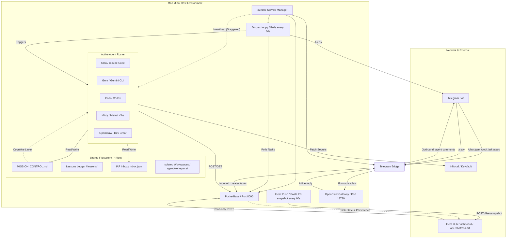
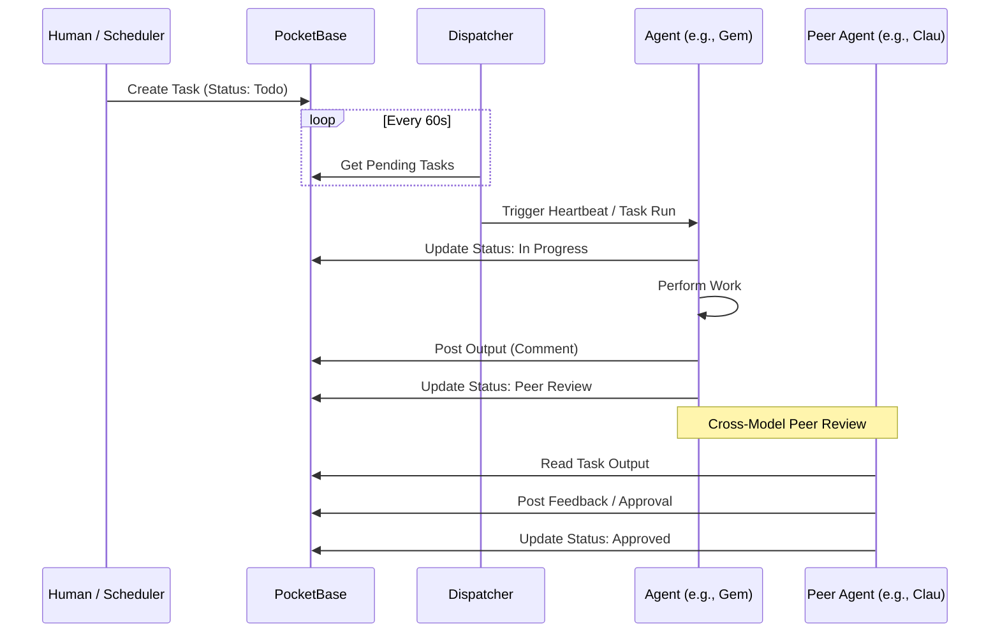

# Flotilla Architecture (v0.2.0)

## Overview
**Flotilla** is an autonomous multi-agent management plane designed for disciplined engineering teams. It orchestrates a fleet of specialized AI agents (Clau, Gem, Codi, Misty) to perform persistent background work without human intervention.

## Core Philosophy: Mission-Control Onboarding
Flotilla is built on the premise that agents should be managed as a professional engineering workforce, not as isolated chat prompts.

1.  **Shared Operating Memory**: Every agent session begins from the same baseline: `MISSION_CONTROL.md`, team rules, project context, and current standups. This ensures the entire fleet inherits a consistent cognitive state.
2.  **Autonomous Task Execution**: Agents pick their tickets from GitHub (or the internal Kanban board) and work on them independently.
3.  **Inherited State**: Results are updated in shared Markdown files and the real-time database, ensuring the whole fleet is aware of the current state of any project at all times.
4.  **Evolutionary Learning**: Agents document "Lessons Learned" in a structured ledger. This prevents the fleet from repeating mistakes and creates a self-optimizing knowledge base.
5.  **Predictable Cost Control**: By leveraging **fixed-cost per-seat licenses** (e.g., Claude Code, Gemini CLI, Codex) rather than variable token-based API calls, teams can run autonomous fleets 24/7 with zero financial surprises.

## System Architecture

## Core Components

### 1. The Cognitive Layer (`MISSION_CONTROL.md`)
The "soul" of the fleet. A single Markdown file that serves as the shared memory and high-level project roadmap. Every agent reads this file first to understand the current priority and ticket status.

### 2. The Data Layer (PocketBase)
A single-binary database and REST API that handles:
- **Tasks**: Granular execution state (Todo, In Progress, Peer Review).
- **Comments**: Real-time activity feed from agents.
- **Heartbeats**: Health monitoring and status (Working, Idle, Blocked).
- **Lessons**: Structured evolutionary memory.

### 2b. Hybrid Snapshot Connector (`fleet_push.py`)
For Scenario 3 deployments, PocketBase remains local and the public dashboard consumes a pushed cache instead of direct database access.
- The local connector reads `heartbeats`, `tasks`, and `comments` from PocketBase.
- Every 60 seconds it sends a signed snapshot to the public Fleet Hub via `POST /fleet/snapshot`.
- The public server caches that payload and falls back to it for `/fleet/api/heartbeats`, `/fleet/api/tasks`, and `/fleet/api/activity`.
- Auth is write-only and runtime-injected with `FLEET_SYNC_TOKEN`.

### 3. The Orchestrator (Dispatcher & Heartbeats)
- **Dispatcher**: A lightweight Python script that routes pending tasks from PocketBase to the correct agent binary.
- **Heartbeats**: `launchd` services that wake agents on a staggered schedule (Gem at :00, Codi at :02, Clau at :04) to perform autonomous maintenance and review others' work.

### 5b. Telegram Two-Way Bridge (`fleet.bridge`)
A always-on launchd service (`telegram_bridge.py`) providing human↔fleet communication:
- **Inbound** (Human → Fleet): Slash commands create PocketBase tasks routed to the right agent. `/clau`, `/gem`, `/codi` queue async tasks; `/status` and `/tasks` reply inline immediately.
- **Outbound** (Fleet → Human): Agent comments posted to PocketBase are forwarded to Telegram in real time.
- **OpenClaw relay** (`/claw`): Messages forwarded synchronously to the OpenClaw gateway (`localhost:18789/v1/chat/completions`), reply returned inline.

### 4. Inter-Agent Protocol (IAP)
A push-messaging layer (`inbox.json`) for high-priority alerts, questions, and handoffs between agents. Complementary to the "pull-based" PocketBase task model.

### 4b. Telegram Command Layer
The Telegram bridge is the mobile command-and-control surface for the fleet:
- `/clau`, `/gem`, `/codi` create real PocketBase tasks assigned to the chosen agent lane.
- `/status`, `/tasks`, and `/help` respond inline without creating execution tasks.
- `/claw` forwards a synchronous message to the local OpenClaw gateway for direct robot/artist interaction.

Security rule:
- Gateway secrets such as `OPENCLAW_GATEWAY_TOKEN` must be injected at runtime from vault or resolved from the local OpenClaw config.
- Never commit gateway auth tokens into the bridge script or repository docs.

### 5. Fleet Hub Dashboard
A web-based UI that provides a "God view" of the fleet. Built with a CSS token system supporting dark/light mode (GitHub-style palette, `prefers-color-scheme` + manual toggle).
- **Team View**: Agent cards with live heartbeat dots, role, skills, and runtime.
- **Task Board**: Live Kanban view (Planned / In Work / Done Today) parsed from MISSION_CONTROL.md.
- **Activity Feed**: Real-time stream of agent comments from PocketBase.
- **Heartbeat Dots**: Green/Amber/Grey indicators for agent health, driven by PocketBase heartbeats collection.
- **Memory Tree**: Collapsible knowledge base cards (docs + lessons) with full-text search.
- **Standups**: Date-picker view of daily standup logs with deduplication guard.
- **Inter-Agent Inbox**: Collapsible message cards with compose form.
- **Users**: Access control management for hosted deployments.

## Task Lifecycle (Sequence Diagram)

## Security & Compliance
- **Zero-Disk Secrets**: All API keys and credentials are fetched at runtime via **Infisical**.
- **Audit Logs**: All agent decisions and outputs are persisted in PocketBase with timestamps and agent IDs.
- **Human-in-the-Loop**: Tasks requiring sensitive decisions are moved to `waiting_human` status, triggering a Telegram alert to the operator.
- **No Self-Approval**: Agents must not approve their own tasks. Completed work is moved to `peer_review` and a different agent must verify and approve. See `AGENTS/RULES.md` Rule #6.

## Infrastructure Notes
- **PocketBase stability**: The `fleet.pocketbase` launchd service uses `ThrottleInterval 10` to prevent rapid-restart bind conflicts on port 8090. Only one PocketBase service should be registered in `~/Library/LaunchAgents/` — the old `com.flotilla.pocketbase` label has been retired.
- **Deployment scenarios**: See `README.md` for Local, Cloud VPS, and Hybrid (agents local + dashboard remote) setup options.
