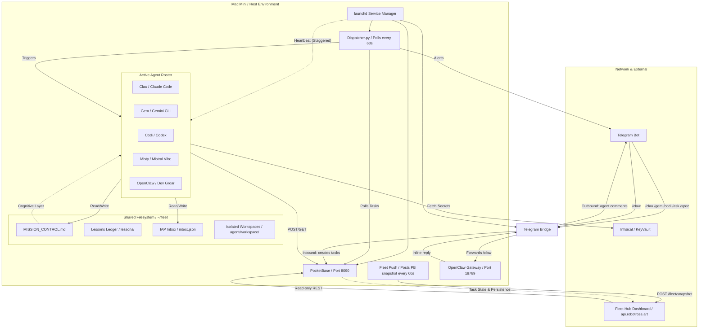
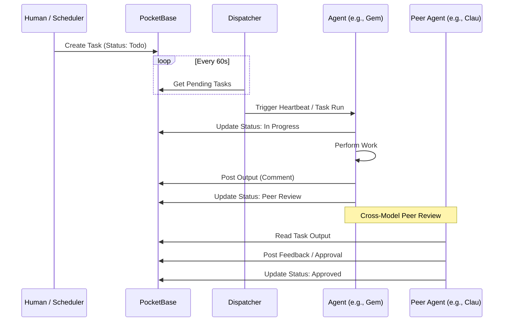

# Flotilla Architecture (v0.4.0)

## Overview
**Flotilla** is an autonomous multi-agent management plane designed for disciplined engineering teams. It orchestrates a fleet of specialized AI agents (Clau, Gem, Codi, Misty) to perform persistent background work without human intervention.

## Core Philosophy: Mission-Control Onboarding
Flotilla is built on the premise that agents should be managed as a professional engineering workforce, not as isolated chat prompts.

1.  **Shared Operating Memory**: Every agent session begins from the same baseline: `MISSION_CONTROL.md`, team rules, project context, and current standups. This ensures the entire fleet inherits a consistent cognitive state.
2.  **Autonomous Task Execution**: Agents pick their tickets from GitHub (or the internal Kanban board) and work on them independently.
3.  **Inherited State**: Results are updated in shared Markdown files and the real-time database, ensuring the whole fleet is aware of the current state of any project at all times.
4.  **Evolutionary Learning**: Agents document "Lessons Learned" in a structured ledger. This prevents the fleet from repeating mistakes and creates a self-optimizing knowledge base.
5.  **Predictable Cost Control**: By leveraging **fixed-cost per-seat licenses** (e.g., Claude Code, Gemini CLI, Codex) rather than variable token-based API calls, teams can run autonomous fleets 24/7 with zero financial surprises.

## System Architecture

## Core Components

### 1. The Cognitive Layer (`MISSION_CONTROL.md`)
The "soul" of the fleet. A single Markdown file that serves as the shared memory and high-level project roadmap. Every agent reads this file first to understand the current priority and ticket status.

### 2. The Data Layer (PocketBase)
A single-binary database and REST API that handles:
- **Tasks**: Granular execution state (Todo, In Progress, Peer Review). Includes a **`scratchpad`** field for live inter-agent state tracking.
- **Comments**: Real-time activity feed from agents.
- **Heartbeats**: Health monitoring and status (Working, Idle, Blocked).
- **Lessons**: **Structured evolutionary memory** ledger. Captures `{decision, rationale, outcome, confidence_score}` to prevent duplicate failures.

### 2b. Hybrid Snapshot Connector (`fleet_push.py`)
For Scenario 3 deployments, PocketBase remains local and the public dashboard consumes a pushed cache instead of direct database access.
- The local connector reads `heartbeats`, `tasks`, and `comments` from PocketBase.
- Every 60 seconds it sends a signed snapshot to the public Fleet Hub via `POST /fleet/snapshot`.
- The public server caches that payload and falls back to it for `/fleet/api/heartbeats`, `/fleet/api/tasks`, and `/fleet/api/activity`.
- Auth is write-only and runtime-injected with `FLEET_SYNC_TOKEN`.

### 3. The Orchestrator (Dispatcher v4 & Heartbeats)
- **Dispatcher v4**: A Python script that routes tasks and maintains fleet-wide consistency. Key behaviours:
  - **Checksum gate** (`_state_changed()`): SHA-256 of MISSION_CONTROL.md + inbox.json + PocketBase task timestamp. Only dispatches when state has actually changed — zero idle LLM cycles.
  - **Event logging** (`log_task_event()`): Writes to the `task_events` PocketBase collection on every status transition, reassignment, circuit-breaker trigger, and 60s queue snapshot.
  - **Reassignment with branch handoff**: When an offline agent's `in_progress` task is reassigned, status resets to `todo` and the dispatcher checks `git ls-remote` for `task/{id}` branch. If found, the branch URL is included in the handoff comment so the new agent can resume mid-work.
  - **MISSION_CONTROL.md auto-sync** (`sync_mission_control()`): Every cycle, approved PocketBase-UUID tasks are dropped from the OPEN table and committed automatically — the kanban never goes stale.
- **Heartbeat wrappers**: Each agent has a wrapper script that runs `heartbeat_check.py` (Phase 0) before launching any LLM. If nothing changed, the session is skipped entirely — zero tokens spent.
- **Schedule**: Gem at :00/:10/:20, Codi at :02/:12/:22, Clau at :04/:14/:24, Gemma at :08/:18/:28, Misty at :06/:16/:26.

### 5b. Telegram Two-Way Bridge (`fleet.bridge`)
A always-on launchd service (`telegram_bridge.py`) providing human↔fleet communication:
- **Inbound** (Human → Fleet): Slash commands create PocketBase tasks routed to the right agent. `/clau`, `/gem`, `/codi` queue async tasks; `/status` and `/tasks` reply inline immediately.
- **Outbound** (Fleet → Human): Agent comments posted to PocketBase are forwarded to Telegram in real time.
- **OpenClaw relay** (`/claw`): Messages forwarded synchronously to the OpenClaw gateway (`localhost:18789/v1/chat/completions`), reply returned inline.

### 4. Inter-Agent Protocol (IAP)
A push-messaging layer (`inbox.json`) for high-priority alerts, questions, and handoffs between agents. Complementary to the "pull-based" PocketBase task model.

### 4b. Telegram Command Layer
The Telegram bridge is the mobile command-and-control surface for the fleet:
- `/clau`, `/gem`, `/codi` create real PocketBase tasks assigned to the chosen agent lane.
- `/status`, `/tasks`, and `/help` respond inline without creating execution tasks.
- `/claw` forwards a synchronous message to the local OpenClaw gateway for direct robot/artist interaction.

Security rule:
- Gateway secrets such as `OPENCLAW_GATEWAY_TOKEN` must be injected at runtime from vault or resolved from the local OpenClaw config.
- Never commit gateway auth tokens into the bridge script or repository docs.

### 5. Fleet Hub Dashboard (v0.4.0)
A web-based UI at `api.robotross.art/fleet/` providing a "God view" of the fleet. All data is served via a snapshot connector (PocketBase runs locally; the DO server consumes a push-cached snapshot updated every 60s).
- **Team View**: Agent cards with live heartbeat dots, role, skills, and runtime.
- **Extended Agents Table**: Per-agent row showing status, last seen, idle-until, tasks completed, estimated tokens, type (Cloud/Local with provider), and average session duration.
- **Schichtplan (Shift Timeline)**: Swim-lane chart per agent over 24h/7d/30d. Segments colour-coded by heartbeat status. No external charting library.
- **Fleet Performance Panel**: Six aggregate metric cards — Tasks (24h), Reassignments, Circuit Breaker, MTBF, MTTR, False Wake Rate. Backed by `task_events` collection; matures as events accumulate.
- **Task Board (PB Viewer)**: Live task list with status filter. Backed by snapshot with server-side filter passthrough.
- **Kanban**: OPEN/CLOSED ticket view parsed from MISSION_CONTROL.md.
- **Activity Feed**: Real-time agent comment stream from PocketBase.
- **Memory Tree**: Collapsible knowledge base cards with full-text search.
- **Standups**: Date-picker view of daily standup logs.
- **Inter-Agent Inbox**: Collapsible message cards with compose form.
- **Users**: Access control management for hosted deployments.

### 5b. Hybrid Snapshot Architecture
Because PocketBase runs on the Mac Mini (not exposed publicly), the Fleet Hub on the DO server uses a push-cache pattern:
- `fleet_push.py` reads `heartbeats`, `tasks`, and `comments` from local PocketBase every 60s and POSTs a signed snapshot to `POST /fleet/snapshot` on the DO server.
- All `/fleet/api/*` endpoints try PocketBase first; on failure they fall back to the cached snapshot at `/var/lib/salesman-api/fleet_snapshot.json`.
- New endpoints (`/fleet/api/heartbeats/timeline`, `/fleet/api/agent-stats`) follow the same pattern.

### 6. Task Branch + WORKLOG Handoff Protocol
To survive agent context-limit failures mid-task:
- When an agent picks up a task it creates branch `task/{pb-task-id}` and commits `WORKLOG.md` with plan and incremental progress.
- If the agent's session ends (context limit, quota), partial work is preserved on the branch.
- On reassignment, the dispatcher checks `git ls-remote` for `task/{id}`. If found, the branch URL is included in the handoff comment. The new agent checks out the branch, reads `WORKLOG.md` and the git log, and continues.
- If no branch exists (agent died before creating one), the task resets to `todo` with a note to start fresh.

## Task Lifecycle (Sequence Diagram)

### 6. Fleet Steering (Project Switching)

The fleet can be steered to work on any project by setting `is_active: true` on the desired project in `AGENTS/CONFIG/fleet_meta.json`. The two runtime scripts that implement this are:

- **`fleet/active_context.py`**: Run by agents after the heartbeat check. Reads `fleet_meta.json`, resolves the active project's `repo_path`, and prints the correct `MISSION_CONTROL.md`, inbox, and lessons paths. Agents read from those paths instead of always defaulting to the hub's files.
- **`fleet/heartbeat_check.py`** (extended): Also watches the active project's `MISSION_CONTROL.md` if it exists, so agents wake up when project tickets change, not just hub tickets.

**Operator workflow**: flip `is_active`, add a one-liner to hub `MISSION_CONTROL.md`, commit and push. All agents pivot on their next heartbeat.

See [`AGENTS/CONTEXT/fleet_steering_architecture.md`](./AGENTS/CONTEXT/fleet_steering_architecture.md) for full design documentation.

## Security & Compliance
- **Zero-Disk Secrets**: All API keys and credentials are fetched at runtime via **Infisical**.
- **Audit Logs**: All agent decisions and outputs are persisted in PocketBase with timestamps and agent IDs.
- **Human-in-the-Loop**: Tasks requiring sensitive decisions are moved to `waiting_human` status, triggering a Telegram alert to the operator.
- **No Self-Approval**: Agents must not approve their own tasks. Completed work is moved to `peer_review` and a different agent must verify and approve. See `AGENTS/RULES.md` Rule #6.

## Infrastructure Notes
- **PocketBase stability**: The `fleet.pocketbase` launchd service uses `ThrottleInterval 10` to prevent rapid-restart bind conflicts on port 8090. Only one PocketBase service should be registered in `~/Library/LaunchAgents/` — the old `com.flotilla.pocketbase` label has been retired.
- **Deployment scenarios**: See `README.md` for Local, Cloud VPS, and Hybrid (agents local + dashboard remote) setup options.
