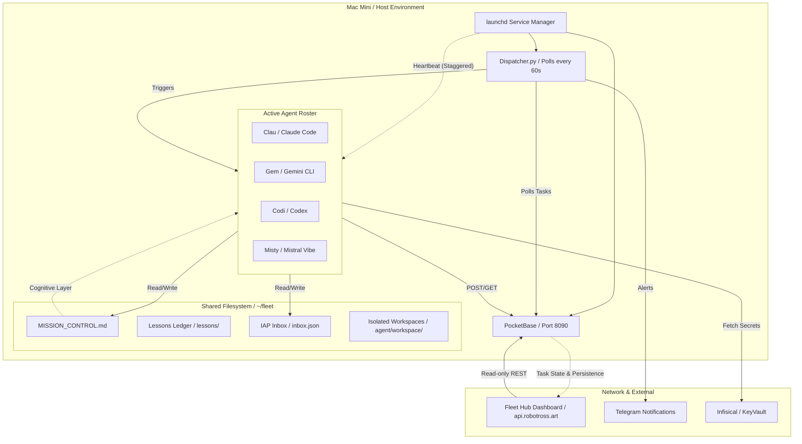
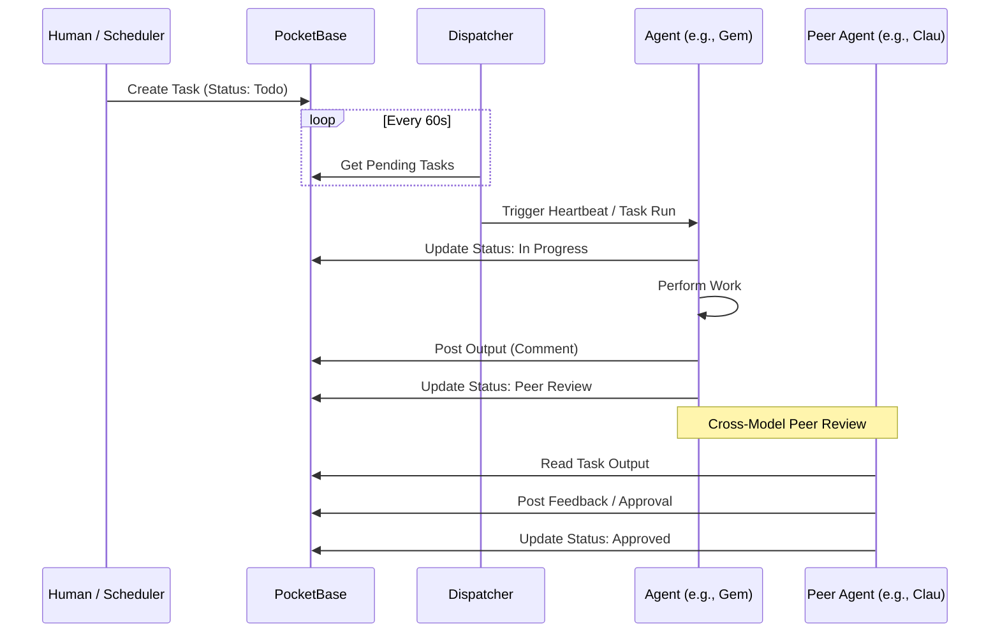

# Flotilla Architecture (v0.1.0)

## Overview
**Flotilla** is an autonomous multi-agent management plane designed to run persistently on a local environment (e.g., Mac Mini). It orchestrates a fleet of specialized AI agents (Clau, Gem, Codi, Misty) using a combination of a shared filesystem, a real-time database, and a staggered heartbeat system.

## System Architecture

## Core Components

### 1. The Cognitive Layer (`MISSION_CONTROL.md`)
The "soul" of the fleet. A single Markdown file that serves as the shared memory and high-level project roadmap. Every agent reads this file first to understand the current priority and ticket status.

### 2. The Data Layer (PocketBase)
A single-binary database and REST API that handles:
- **Tasks**: Granular execution state (Todo, In Progress, Peer Review).
- **Comments**: Real-time activity feed from agents.
- **Heartbeats**: Health monitoring and status (Working, Idle, Blocked).
- **Lessons**: Structured evolutionary memory.

### 3. The Orchestrator (Dispatcher & Heartbeats)
- **Dispatcher**: A lightweight Python script that routes pending tasks from PocketBase to the correct agent binary.
- **Heartbeats**: `launchd` services that wake agents on a staggered schedule (e.g., Gem at :00, Codi at :02) to perform autonomous maintenance and review others' work.

### 4. Inter-Agent Protocol (IAP)
A push-messaging layer (`inbox.json`) for high-priority alerts, questions, and handoffs between agents. Complementary to the "pull-based" PocketBase task model.

### 5. Fleet Hub Dashboard
A web-based UI that provides a "God view" of the fleet:
- **Task Board**: Live Kanban view of PocketBase tasks.
- **Activity Feed**: Real-time stream of agent thoughts and outputs.
- **Heartbeat Dots**: Green/Amber/Red indicators for agent health.

## Task Lifecycle (Sequence Diagram)

## Security & Compliance
- **Zero-Disk Secrets**: All API keys and credentials are fetched at runtime via **Infisical**.
- **Audit Logs**: All agent decisions and outputs are persisted in PocketBase with timestamps and agent IDs.
- **Human-in-the-Loop**: Tasks requiring sensitive decisions are moved to `waiting_human` status, triggering a Telegram alert to Miguel.
